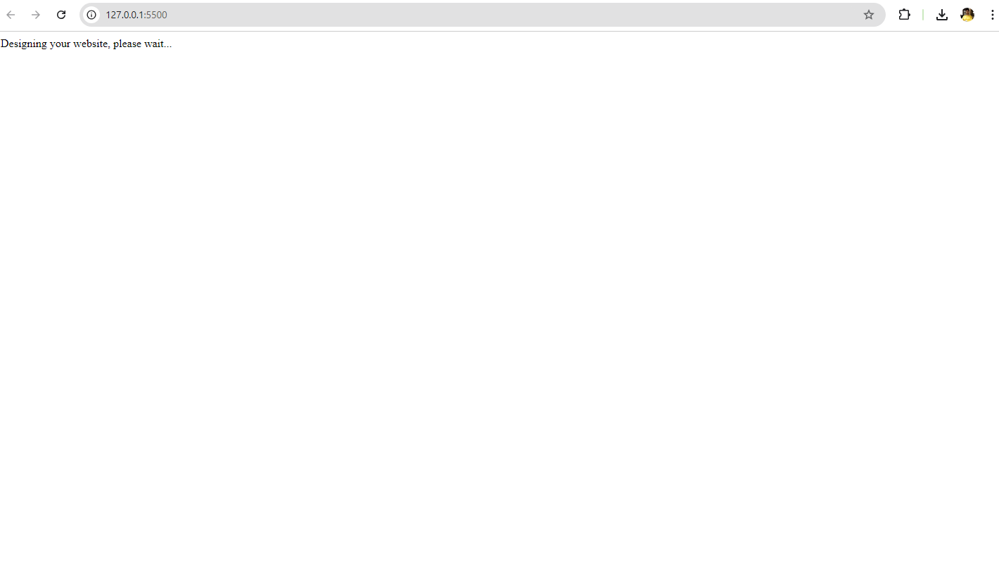
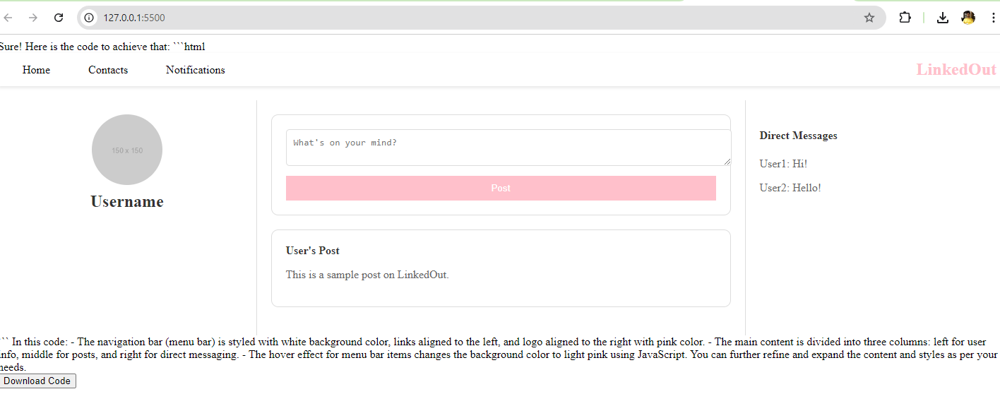

# GptDesigner

## Beskrivning
Ett kul kvällsprojekt som jag gjorde för att se hur det skulle vara att ha ett AI-förstärkt webbdesign verktyg som tar in en beskrivning av användaren och genererar en hemsida utefter användarens önskemål.

## Set-up
För att köra detta lokalt på din maskin behöver du endast skaffa en användarnyckel från OpenAi. Klistra in denna i script.js-filens variabel "gptKey" som finns på andra raden i det dokumentet, och du är good to go!

## Hur det fungerar

|Beskriv hur du vill att designen ska se ut|
|------------------------|
| |

|Vänta medans din förfrågan bearbetas|
|------------------------|
|  |

|Resultatet renderas direkt framför ögonen på dig! Längst ner finns en nedladdningknapp som hämtar hem koden som användes för designen.|
|------------------------|
|  |
